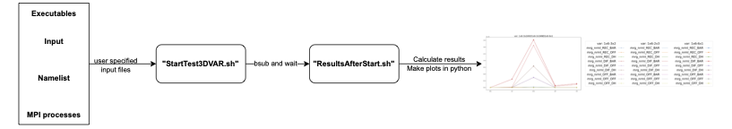
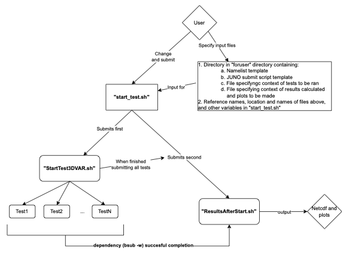

# OceanVar Test Suite

This test suite was created by F. Carere (francesco.carere@cmcc.it), primarily in June-July 2024.

## 1. Why this test suite?
This test suite was designed to automate part of the compile/run/test/debug process for bitwise reproducibility (BR) testing when running **OceanVar** with different compilers (and compiler options), input files, namelist settings, and MPI process decompositions.
In particular, the compilation is **NOT** automated, only running and testing.

The current version of the test suite can be seen as an automated system/end-to-end test. It is aimed at detecting BR issues, without performaing a root-cause analysis.
The test suite is in beta version and any issues and feature requests may be sent to me personally by email.

The purpose of this test suite is highlighted in the following example, based on experiments conducted at CMCC surrounding MPI bitwise reproducibility.

### 1.1 Example: Automating bitwise reproducibility testing

#### 1.1.1 Context

Suppose you have:
- One compiled executable of **OceanVar**.
- One set of **OceanVar input data** (e.g. grid, initial values for variables, etc.).
- A set of **namelist options**.
- Four different **MPI process decompositions** (one sequential: `1x1` and two with 4 processes, decomposing the grid as: `2x2` and `4x1` and `1x4`).

You wish to test for BR between runs with pairwise different MPI processes.
Changes on the level of machine precision pester these changes in code, which may grow significantly fo long-time integration of chaotic models.

To manually test for BR, one might follow these steps:
1. Run OceanVar in sequential and store the (NetCDF) output in a directory
2. Run OceanVar with `1x4`, `2x2`, and `4x1` MPI processes, storing the (NetCDF) output in 3 more dedicated directories
3. Calculate the differences between the output (e.g. using **Climate Data Operators (CDO)** in the shell or in Python).\
Store the resulting NetCDF files containing the differences in more directories.
4. Visualize and analyse the differences (in even more directories) and make a conclusion (e.g. significant changes occur, MPI code should be reviewed)

While manually conducting this process is feasible, it poses challenges that the test suite is designed to solve:
* **Automated directory structure**: Creating and maintaining a flexible, clear and consistent directory structure for tests, results and plots can be time-consuming. This suite automates directory creation and file naming.
* **Automated creation of metadata**: It provides automatic metadata to track which tests have been run and when, allowing the test suite to serve as an archive. 
* **Automated calculation of results**: Calculating results using CDO or checking for bitwise equality between files (e.g., using `cmp`) is automaed.
* **Automated Plotting**: Plots are generated automatically, ensuring consistent and reproducible visualizations of test results.

The test suite is modular and consists of two modules: running the tests and calculating the results + plotting, see [Section
2.1](ssec:workflow)
In the event of an error, the suite halts and provides an error message. 
You can review the logs (stderr and stdout) to troubleshoot the issue, after which the module may be restarted, see [Section 4](#sec_problems) and [Section 2.1](ssec_example2)


#### <a name="sssec_setup"> </a> 1.1.2 Set-up for automatic BR testing
#### 1.1.2 Set-up for Bitwise Reproducibility Testing
To run BR tests using this suite, you'll need to configure the following 5 files based on your specific setup:
1. **"userconfig.sh"**: a Bash script containing configuration parameters
2. Four files in "full\_config/TESTNAME/" where TESTNAME is the user-specified (in "userconfig.sh") name:
  * A namelist template (in this example called "OceanVar\_nml\_template")
  * A configuration file for tests (called. "tests\_settings.txt")
  * A configuration file for results (called "results\_settings.txt")
  * A template for running the jobs (called "runfile\_local.sh")

An example of the latter four files are in the "full\_config/example" directory and we will now explain what each file contains and how to customize them.
An example of the necessary files is provided in the **"full_config/example"** directory, and we will now explain what each file contains and how to customize them.

##### 1.1.2.1 Creating a New "full\_config" Subdirectory and Setting "userconfig.sh"
Follow these steps to set up the configuration:
1. Create a new subdirectory in the "full\_config" directory (e.g. "full\_config/readme\_BR") and copy the contents of "full\_config/example" into this new directory. 
2. Ensure that you have the current prerequisites installed as indicated in the "userconfig.sh":
   ```bash
   # PREREQUISITES
   # Bash >= 4.x
   # A conda environment with Python >= 3.11.5 (for *-unpacking support)
   # CDO (Climate Data Operators)
   # Python libraries: matplotlib, numpy
   ```
3. Give the test configuration in "userconfig.sh" by specifying the appropriate values:
```bash
ARCH="local"  # Set to "JUNO" if testing on CMCC JUNO supercomputer
...
FULL_CONFIG_SUBDIR="readme_BR"
TEST_NAME="MyFirstTest"
FILECONTEXT_NAME="tests_settings.txt"
NAMELIST_TEMPLATE_NAME="OceanVar_nml_template"
RUNTEST_TEMPLATE_NAME="runfile_local.sh"
...
RESULTS_NAME="$TEST_NAME"
PLOTS_NAME="$TEST_NAME"
RESULTSCONTEXT_NAME="results_settings.txt"
CONDA_ENV=@YOUR_CONDA_ENVIRONMENT@  # Specify your conda environment
...
FILES_OUT=("corr_eta.nc" "corr_sal.nc" "corr_tem.nc" "corr_uvl.nc" "corr_vvl.nc" "iterate.dat" "sla_stat.txt" "arg_stat.txt" "obs.dat")
...
TYPE_RESULTS="max" # This can be changed to "mean", "sum"., for different types of results.
```
4. Replace @YOUR_CONDA_ENVIRONMENT@ with the name of the conda environment you are using. If you prefer not to use conda, you will need to manually activate a Python file for generating plots, which will interrupt the automated workflow.

An explanation of the of the fields in "userconfig.sh" can be found in the within the file itself, or in Section [4. Using the test suite](#sec_usage).

The four files in the "full\_config/readme\_BR" directory (i.e., "tests\_settings.txt", "OceanVar\_nml\_template", "runfile\_local.sh", and "results\_settings.txt") should be adapted according to your specific setup. 

For now, the provided files are already configured, so we will display their content below.
##### <a name="ssssec_nml"></a> 1.1.2.2 Configuring the namelist template 
In this example the namelist template is called "OceanVar\_nml\_template".
This  file as found at "full\_config/example/OceanVar\_nml\_template", containing:
1. **Fixed values**: constand across tests.
2. **Placeholders**: Fields enclosed by "@" symbols (e.g. "@IDNAME@")  will be replaced by the test suite with specific values,
   see [Section 1.1.2.3](#ssssec_conftests).

In this example, the placeholder ids are:
* `@FILT@` for the horizontal component of the error covariance matrix,
* `@BAR@` for the balance operator (whether barotropic is used), and
* `@BAL@` for the balance operator (whether dynamic height is used)

**Placeholders ids must be fully capitalized**.

To specify to the test suite which placeholder values are set, the placeholders will be passed to the configuration files of the tests ([Section 1.1.2.3](#ssssec_conftests)) and of the results ([Section
1.1.2.4](#ssssec_confresults")) by specifying the respective idnames
* `filt`
* `bar`
* `bal`

The test suite will automatically look for the capitalized versions (e.g. not `@filt@` but `@FILT@`).

In this example in particular, we will only consider one value for all three (placeholder) fields.
This means that effectively these parameters are fixed across tests.


##### <a name="ssssec_conftests"> </a> 1.1.2.3 Configuring the tests 
In this example the file containing the configuration of the tests to be executed is called "tests\_settings.txt".
This file can be found in the "full\_config/example" directory. Its content is:

```bash

# EXE: Specify the number of executable and their names and (absolute or relative) paths
nexe=1
OV ../bin/OceanVar

# NINPUT: Specify the number of input datasets (these should be placed in different directories)
ninput= 1
nrm ../test_case

#Namelist configuration
...
varpergroup= 1 2

filt
DIF
2

bar bal
BAR
1,   1,   1
0,   1,   1

#Finally set processor decomposition that you want to test repro for
nproc= 4
1x1
4x1
2x2
1x4

```

The contents of this file specify that testing is done with:
* one compiled executable of OceanVar with relative path "test\_suite/../bin/OceanVar".
* one set of OceanVar input/data with relative path "test\_suite/../bin/test\_case"
* two GROUPS of namelist placeholders contain respectively 1 and 2 placeholders ids, with ids as specified inSection [1.1.2.2](#ssssec_nml). These placeholder GROUPS can be identified in the file by the combination IDNAME(s), in the next line 1 reference name (used for directory/plot names), and substitution of the placeholder values with the specified IDNAMEs.
* 4 MPI process decompositions to test with

In total we therefore have 4 tests being ran (1 exec, 1 set of data, 1 filt(er), 1 simultaneous substitution of bar/bal placeholders and 4 MPI processes)

##### <a name="ssssec_confresults"></a> 1.1.2.4 Configuring the results
In this example, the file containing the configuration of the results to be calculated is called "results\_settings.txt".
The file can be found the "full\_config/example" directory. Its content is:

```bash

# EXE: Specify the number of executable and their names and (absolute or relative) p
nexe=1
fixed
OV

# NINPUT: Specify the number of input datasets and their names
ninput= 1
fixed
nrm

# Namelist configurations
varpergroup= 1 2

filt
fixed
DIF

bar bal
fixed
BAR


# MPI process decomposition
nproc= 4
var
1x1
1x4
2x2
4x1

```

The configuration file for the results is similar to the configuration file for the tests.
The reason these files are split is to enhance the modularity of the code (See [Section 4.3]($ssec_modular_results))

The main difference is the `var` and `fixed` expressions, which indicate whether differences should be calculated across this variable (e.g. across executables, across input data, etc..).

- When `var` is used, differences between output variables _are_ calculated.
For example, for the tests with exe=`OV`, inp=`nrm`, filt=`DIF`, bar=bal=`BAR`, four tests will be ran with `1x1`, `1x4`, `2x2` and
`4x1` processes.
Using `var` after the line containing `nproc` implies that the 6 pairwise differences (of output files as specified in the
"userconfig.sh" in the `FILES_OUT` variable) will be calculated. This is exactly what we want when testing MPI bitwise reproducibility.
- When `fixed` is used, differences _are not_ calculated. In this case, since there is only one executable, one set of input data, and one substitution for each placeholder group (only `2` for the filt(er) and bar/bal values `1,   1,   1` and `0,   1,   1` are used), the test suite will automatically detect that only one value is present, meaning no differences _can_ be calculated (no pairs of subsitution values exist), so changing the `fixed` paramterers to `var` would leave this test unchanged.

The calculation of differences is relatively hardcoded in the sense that the file expects NetCDF files to be named "corr\_NAME.nc" where "NAME" is the name of the variable.

##### 1.1.2.5 Setting the job script
This file is used for running the job.

```bash
#!/bin/bash
OceanVar_exe="var_3d"
ln -vfs "@EXE@" $OceanVar_exe

mpirun -np @NPROC@ ./$OceanVar_exe 1>"@JOBNAME@out" 2>"@SCRIPTDIR@/../err/@JOBNAME@err"

```

This file likely remains unchanged, the placeholder values (in between the `@` signs) are replaced automatically when running the test suite.
The stder will be redirected to the "err" directory in the "test\_suite" directory.
The stdour will be redirected to a file in a directory made specifically for the according test.

#### 1.1.3 Execution: running the test suite
Once the files are set and all prerequisites are installed, the test suite is run by calling
```bash
$ bash start_test.sh
```
The test suite writes a random number to stdout, which indicates the ID assigned to the test. Running the test suite again will create a new directory with a new ID (if one wants to rerun parts of the test suite with the same random ID, see Section [4](#sec_problems).
Then, the user should wait until all tests are finished.

The test consists of three parts (Section [2](#ssec:workflow)): running the tests, calculating the results, and making the plots.
Three directories "tests", "results", "plots" are made accordingly, in which all output and metadata are stored.

We will now discuss the output generated.

##### 1.1.3.1 The "tests" directory
On the Juno supercomputer, the first job submits all tests simultaneously. Afterward, a job calculating the results is submitted, which depends on the completion of all tests without errors.

On a local architecture, all tests and calculations will run sequentially, after which the calculations are performed.

After starting the test suite, a subdirectory of "tests" will be created with the job name and the random ID number of the current
set of tests.
In this subdirectory you will find:
* a copy of the test configuration (as in [Section 1.1.2.3](#ssssec_conftests)), used only for reference purposes.
* a "rerun\_start.sh" script, which can be executed to restart the tests. Note that input from the "userconfig.sh" file and the "full\_config" subdirectory will be reparsed. If these files are changed, new tests will be run (use the previous copy of the configuration to redo all tests in identical fashion w.r.t. the previous time)
* a metadata file, containing the output of the job that starts all testruns
* subdirectories with the different executables, input datasets, namelist options, and MPI processes (in this order). These subdirectories contain respectively:
  - a copy of the executable (and the inputdata subdirectories)
  - nothing (and the namelist options subdirectories)
  - nothing (and the MPI processes subdirectories)
  - an executable which can rerun the testrun, stdout of this testrun, output of OceanVar of this testrun, including diagnostics files

If a test fails, the test suite will stop (on Juno, the submitted job calculating the results will remain indefinitely pending).
In this case, you need to solve the problem in the OceanVar simulation (assuming the issue lies outside the test suite).
Then, you can restart the tests using the "rerun\_start.sh" script or the job script in the dedicated subdirecroty to rerun a single job, both mentioned above, see also [Section 4](#sec_problems)

##### 1.1.3.2 The "results" directory
The "results" directory, similar to the "tests" directory, contains
* a copy of the file containing the configuration of the results (as in [Section 1.1.2.4](#ssssec_confresults)), used only for reference purposes
* a "rerun\_results.sh" script, which can be executed to restart the calculations of the results. Note that input from the "userconfig.sh" file and the "full\_config" subdirectory will be reparsed. If these files are changed, new results will be calculated (use the previous copy of the configuration to redo all tests as they were done the previous time)
* subdirectories with PAIRS of tests, seperated by the "\_V\_" expression, where the tests are named by executables, inputdata, namelist options and, MPI processes (in this order) these subdirectories contain respectively. These contain:
  - the results of the calculation, starting with "L1" since the L1 norm is used to calculate the errors. It is either "L1max.txt" containing the maximum differences or "L1sum.txt", containing the sum of the L1 differences over the grid, where differences are between the files in the NetCDF output of OceanVar of the tests as suggested by the directory name;
  - A diagnostics file, stating, for example, whether every file is bitwise equal or not

If the results fail, they can be rerun using the "rerun\_results.sh" script mentioned above  ([Section 4](#sec_problems)).
Already calculated results will not be recalculated.\
**NOTE:** If the "gen\_plots.py" file exists in the respective "plots" directory (below), then no calculations will be done. Therefore, this file should be removed first.

One can calculate multiple results from one set of "tests" (one "tests" subdirectory), by changing the configuration file "configure.sh" and the files in the respective "full\_config" subdirectory.

##### 1.1.3.3 The "plots" directory
The "plots" directory, similar to the "results" and "tests" directories, contains:
* a copy of the configuration of the results (as in [Section 1.1.2.4](#ssssec_confresults)), used only for reference purposes
* A diagnostics file, stating, for example, whether every file is bitwise equal or not
* The Python file "gen\_plots.py"

Please ensure that the Python version is at least 3.11.5.
If Anaconda is not installed, the test suite will fail just before plotting, but it will still produce the "gen\_plots.py" file, which can then be run independently.

### <a name="ssec_example2"></a> 1.2 A more complicated example
In this section, we present a more extensive example, showing how to
1. vary multiple parameters;
2. add tests to an exising tests repository/subdirectory;
3. calculate and make multiple sets of results and plots.

Out of the 5 configuration files ([Section 1.1.2](#sssec_setup)), the ones that will be modified are the "userconfigure.sh" file, the namelist template, and the job script.
Note however, that rerunning the test suite i.e.
```bash
$ bash start_test.sh
```
will create new "tests", "results" and "plots" subdirectories (with a new random integer for reference).

The tests and results configuration files are modified as follows:

```bash

# EXE: Specify the number of executable and their names and (absolute or relative) paths
nexe=2
OV ../bin/OceanVar
VV ../bin/OceanVar_changed

# NINPUT: Specify the number of input datasets, their names and their paths (these should be placed in different directories)
ninput= 2
nrm ../test_case
big ../somewhere

# Namelist configurations
varpergroup= 1 2

filt
OFF REC DIF
0|1|2

bar bal
BAR DH
1,   1,   1|0,  1,  1
0,   1,   1|1,  1,  1

# MPI processs decomposition
nproc= 4
1x1
4x1
2x2
1x4

```

And the results configuration file

```bash

# EXE: Specify the number of executable and their names and (absolute or relative) paths
nexe=1
var
OV
VV

# NINPUT: Specify the number of input datasets, their names and their paths (these should be placed in different directories)
ninput= 1
fixed
nrm
big

# Namelist configurations
varpergroup= 1 2

filt
fixed
OFF REC DIF

bar bal
fixed
BAR DH


# MPI processs decomposition
nproc= 4
var
1x1
1x4
2x2
4x1


```

Thus, in total 2\*2\*3\*3\*4=144 tests are executed (two executables, two input datasets, 3 filter namelist parameters, 3 balance operator namelist parameters and 4 MPI processes)

#### 1.2.1 Remarks about the test configuration file
Notice that the namelist parameters are separated with the pipe '|' character. Thus 3 values for the `@FILT@` placeholder in the namelist template are subsituted: 
- `0` = no filter  
- `1` = recursive filter  
- `2` = diffusive filter.
They are respectively called `OFF`, `REC`, `DIF`.

The placeholders `@BAR@` and `@BAL@` are substituted simultaneously.
Two values are substituted, with reference names `BAR` and `DH`.
Two values for the `@BAR@` placeholder are substituted in the namelist template:  
- `1, 1, 1` (barotropic model ON) in the first case  
- `0, 1, 1` (barotropic model OFF) in the second case.

Simultaneously two values for the `@BAL@` placeholder are substituted.
- `1, 1, 1` (dynamic height ON) in the second case  
- `0, 1, 1` (dynamic height OFF) in the first case.


Consequently, the two configurations placeholder group containing the bar and bal ids have the reference names (used for directory
naming):  
- `BAR` (barotropic model ON, dynamic height OFF)  
- `DH` (barotropic model OFF, dynamic height ON)  

#### 1.2.2 Remarks about the results configuration file
Notice that the namelist parameters are separated with the pipe `|` character. 
Thus, the expression `1|2|3` indicates that 3 values for the `@FILT@` placeholder in the namelist template are substituted:  
- `0` = no filter  
- `1` = recursive filter  
- `2` = diffusive filter.

Notice now that the results between the `nrm` and `big` datasets are not calculated (`fixed` expression), they are perhaps deemed incomparable.
This holds similarly for the different filters and balance operators (the namelist parameters).
However, differences between the two executables (so in a sense a regression test is considered) and between MPI processes *are* considered (`var` expression).
Note that, doing so, both can vary simultaneously: results between the test using the `OV` executable with `1x1` MPI process are compared with the test using the `VV` executable with `2x2` MPI processes.

#### 1.2.3 Adding tests and results to the existing directories
Suppose we have another executable `VO` which we forgot to add to the previous test configuration file.
So instead of

```bash

#EXE: Set executables and name
nexe=1
OV ../bin/OceanVar
VV ../bin/OceanVar_changed

```

we actually wanted

```bash

#EXE: Set executables and name
nexe=1
OV ../bin/OceanVar
VV ../bin/OceanVar_changed
VO ../bin/OceanVar_changed2

```

What we can do to solve this, is change the configuration file and rerun the tests, i.e. execute the `start_rerun.sh` bash script in the respective `tests` subdirectory.  
The test suite will only run tests for which it cannot find OceanVar output (as passed in the "userconfig.sh" file as "FILES\_OUT").

Similarly, new results can be calculated. Note that one must first remove the "gen\_plots.py" file in the respective "plots" subdirectory.

## 2. The global and the detailed workflow

### 2.1 <a name="ssec:workflow"></a> Global workflow
Figure 1:\


On a high level, the suite consists of two bash scripts ([Figure 1](#Figure1)):
1. "StartTestOceanVar.sh",\
parsing 4 configuration files (see [Section 1.1.2](#sssec_setup)) in which the user defines which executables, input, namelist options, and MPI domain decompositions to use in the tests. 
This script submits all the test jobs to the scheduler.

2. "ResultsAfterStart.sh",\
parsing the configuration file for the results in which the user specifies the test options to consider and what to calculate or plot. For example, all tests may be considered, calculating and plotting only the differences between all MPI decompositions, e.g. parallel `3x2` vs sequential `1x1` to check for parallel reproducibility.

##### 2.2 Detailed workflow
The two above-mentioned bash scripts are executed by the script "start\_test.sh", which reads the input as described in [Section 4. Using the test suite](#sec_usage).\
The file "start\_test.sh" is almost always the only file which should be executed in the test suite (exceptions occur when part of the modular workflow fails, Section [4. Problems in the workflow. Avoiding to rerun the whole test suite ](#sec_problems)) or one wants to add tests/results/plots to existing directories (Section [1.2](#ssec_example2)). 
This file should be executed after all test options have been set to preference.

The figure below shows the detailed workflow:\


Two solvable problems can occur in this workflow:
1. If a few of the tests fail, but most of them succeed, then one can avoid rerunning the whole test suite. This is done to avoid wasting resources when rerunning successfully completed tests
2. One wants to have multiple different results and plots from one testing run. Instead of running the test suite twice with different result/plot configurations, one can use test output from successfully finished runs (this comes down to avoiding the "StartTestOceanVar.sh" part of the workflow).

The solutions to these problems are given in [Section 4. Problems in the workflow. Avoiding to rerun the whole test suite ](#sec_problems) and examples are shown in Section [1.2](#ssec_example2)).

#### <a name="sec_struct"></a> 3. The directory structure
**NB: Do not change the directory structure or names, as this will likely result in a broken test suite**

Files which should not be touched by the user can be found in:
* ".scripts/" : containing the main bash scripts, and in .scripts/utils all utility files helping these two scripts or the "start\_test.sh" script.

Files useful for the user, which may be changed, are found in:
* **"full\_config/"**:\
 Containing all the relevant input files and templates. In "full\_config/example" an example of input files and templates is given, consisting of
	1. a namelist template e.g. "OceanVar\_nml\_template"
	2. a job script e.g. "runtest\_ARCH.sh" where ARCH is the architecture
	3. a file containing the configuration of the tests, e.g. "tests\_ettings.txt".\
      This file should be passed to "start\_test.sh" and is used by "StartTestOceanVar.sh"
	4. a file containing the configuration of the results to be calculated e.g. "results\_settings.txt"

The following directories are created after the test suite has been run:
* **"tests/"**:\
 containing the results of the tests, identified by a TESTNAME (passed in "userconfig.sh" to "start\_test.sh"). The directory "tests/$TESTNAME+randomINT/" also contains metadata of the tests, so that one can always understand at a later time what the details of the test were.\
  **NB: please be careful with the characters used in the testname. We advice the use of only alphanumerical characters and underscores.**\
   **NB: For uniqueness of testnames, a random integer is postfixed to the testname**
* **"results/"**:\
 similar to tests, but containing processed data of raw test results.\
	**NB: The results name may have a different name than the testname (since different analysed data and plots can be made from the same test results tests)**\
	**NB: For uniqueness of test names, the random integer is postfixed to the testname** (same number as for the tests)
* **"Plots/" **:\
 contains the plots of the corresponding analyzed data in a "results/" subdirectory.
* **"out/" and "err/"**:\
 contain output files and error files passed from some of the submitted scripts.

### <a name="sec_problems"></a> 4. Troubleshooting/Problems in the workflow. Avoiding to rerun the whole test suite
We will discuss three cases in which one can avoid rerunning parts of the code:
1. If some of the OceanVar tests have failed
2. If the calculation of the results/plots has failed
3. If one wants to calculate multiple results from one test run (i.e. by changing which variables are seen as `fixed` and which as `var`(iable))


#### 4.1 If an OceanVar testrun fails or needs to be rerun
If one or only a few OceanVar tests have failed, but many others have succeeded, then as shown in [Figure showing the workflow](#Workflow_OceanVarTestingsuite.drawio.pdf) the script doing the calculations and the plots will not be executed.

This can be resolved by\
**FIRST:** solving the issue due to which the test have failed (assuming that the cause is not due to the test suite). One can use the stderr (found in "err\") and stdout (found in the respective "tests" subdirectory) files.\
**SECOND:** by rerunning the test. This can be done in two ways:
1. **Running the testcases one by one:** The script to rerun the test can be found in the respective "tests" subdirectory in the "tests/$TESTS\_NAME/\$testdirectory" directory, simply execute the script.
2. **Rerunning "StartTestOceanVar.sh:** by submitting the "rerun\_start.sh" script inside the "tests/$TESTS\_NAME". Tests which have successfully finished are not rerun, since "StartTestOceanVar.sh" checks if all user-specified outputfiles are present. In this way one avoids rerunning tests which have successfully completed.\
**THIRD:** one goes into the respective "results/" subdirectory and runs the "rerun\_results.sh".

#### 4.2 Recalculating the results/plots
If the results/plots have not been calculated successfully (i.e. due to an error running during the Python "gen\_plots.py" file making the plots, or, for example, because some of the testoutput was missing) then one can resubmit/execute the "rerun\_results.sh" file in the respective "results" subdirectory.

**N.B.** the test suite automatically detects if a result has been calculated or if the "gen\_plots.py" file is successfully created. THEREFORE, IF ONE WANTS TO RERUN THE RESULTS, IT IS VERY IMPORTANT TO DELETE THE "gen\_plots.py" FILE IN THE RESPECTIVE "plots" SUBDIRECTORY. Similarly if one wants an already calculated results (possiblye erroneously calculated) to be recalculated, then one has to manually remove this result from the respective "results" subdirectory.

#### <a name="ssec_modular_results"></a> 4.3 If one wants to calculate multiple results from one testrun
Start by completing one full testrun so that one set of testoutput, calculation results and plots is present.
After, one can change the results configuration file in the "full\_config" subdirectory and afterwards execute again the "bsub\_rerun\_results.sh".
One can check in the latter file itself if all variables are still good.


#### 4.4 If one wants to make multiple different plots from one testrun
If one wants multiple plots from one set of results, then one renames the "PLOT\_NAMES" name in the "bsub\_rerun\_results.sh" file, and executes it.
If there is an error in the results or in the calculation of the plots (i.e. the "gen\_plots.py") file, then one removes the respective file in the results AND this python file.
This should also be indicated in the stdout file of the "rerun\_results/sh" file.
